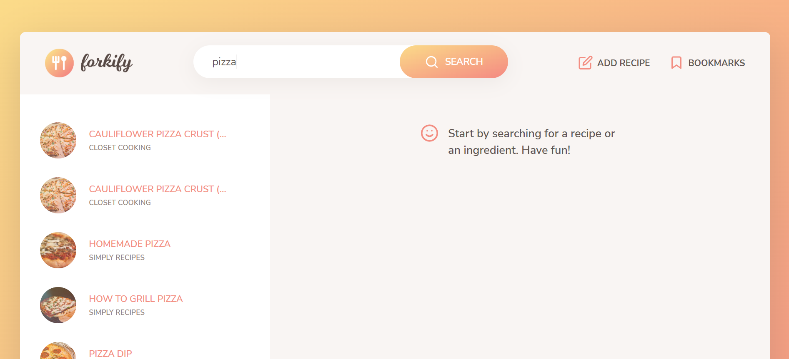
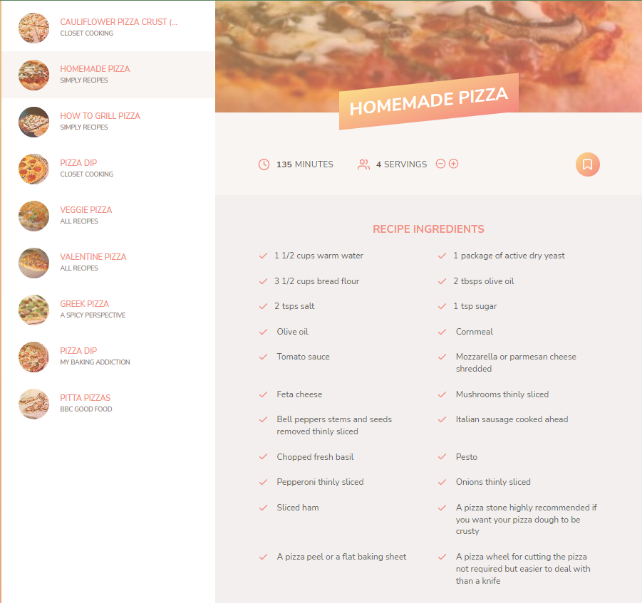
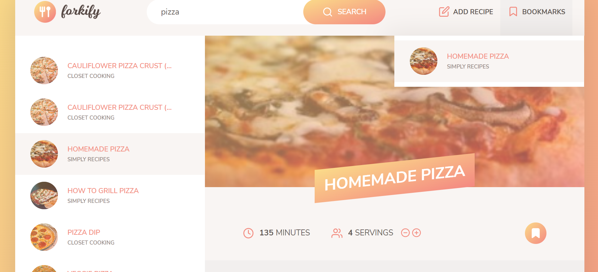
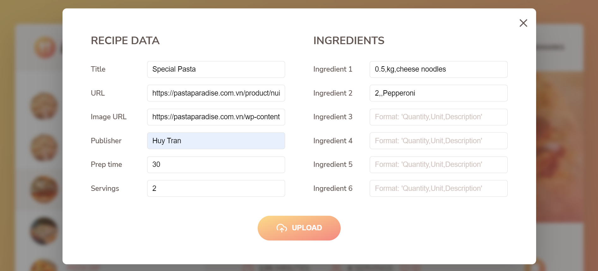
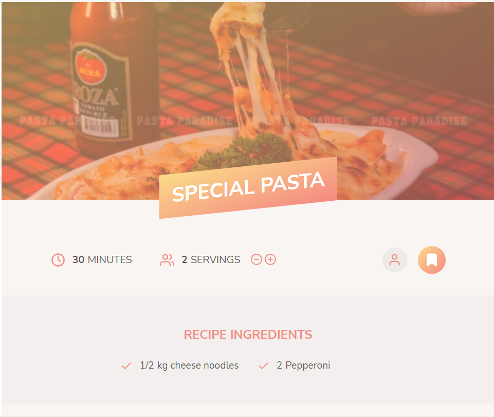

<div align='center'>
<a href="#" target="_blank">
  
</a>
<h1>Forkify</h1>
</div>

---

# Requirement

Clone project and run test.

```
$ cd <project_dir>
$ git clone https://github.com/tranhuy510/forkify-project.git
$ npm install
$ npm start
```

# Main functions

####1. Search recipe
Search recipe by dish name.
<a href="#" target="_blank">

</a>

####2. See recipe details
See details of ingredients, time required according to servings of each recipe
<a href="#" target="_blank">

</a>

####3. Add Bookmarks
Bookmark your favorite recipe to save
<a href="#" target="_blank">

</a>

####4. Add new recipe
Add your personal recipe
<a href="#" target="_blank">

</a>
<a href="#" target="_blank">

</a>

### Link Demo

[Forkify](https://forkify-huytran.netlify.app/)

Thanks for watching!
